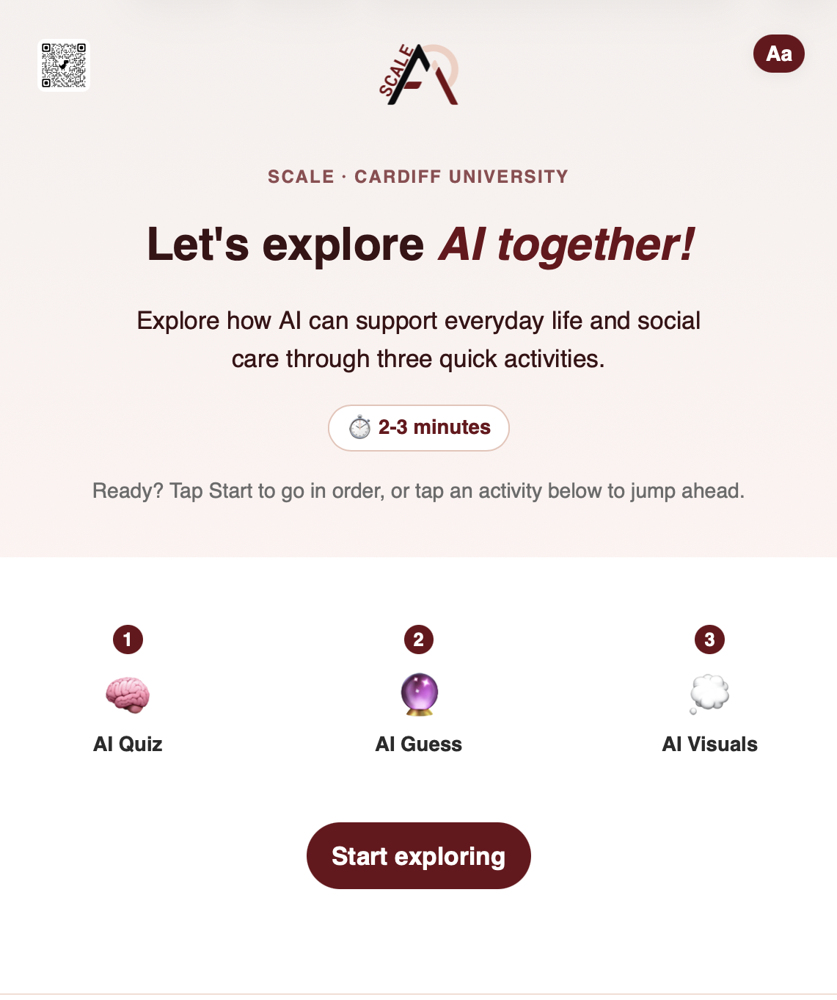
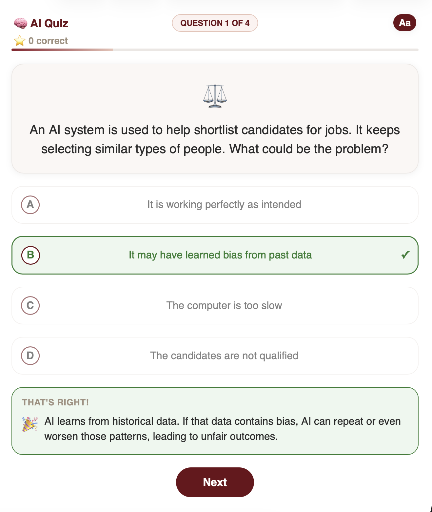
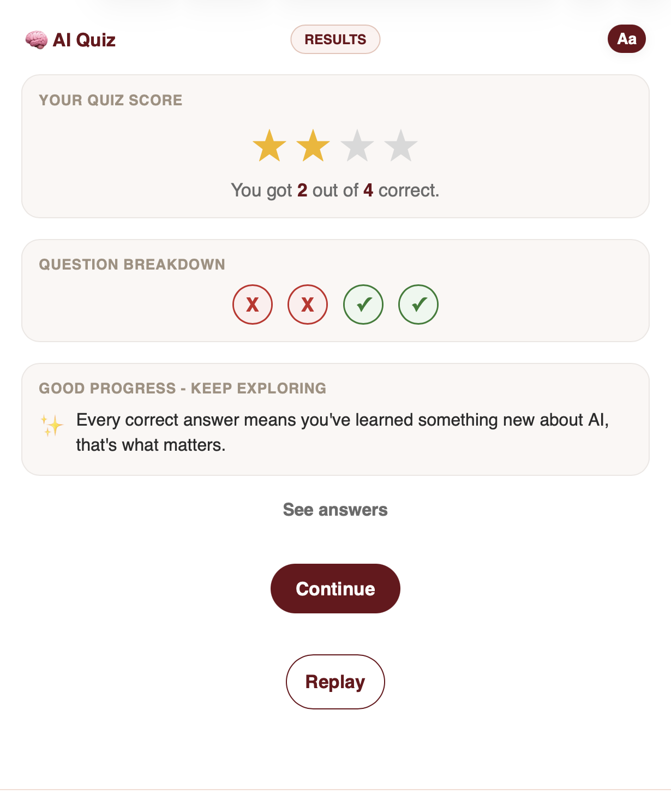
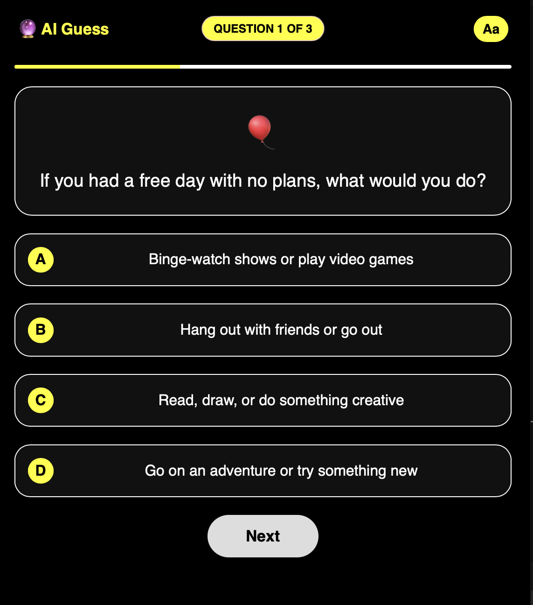
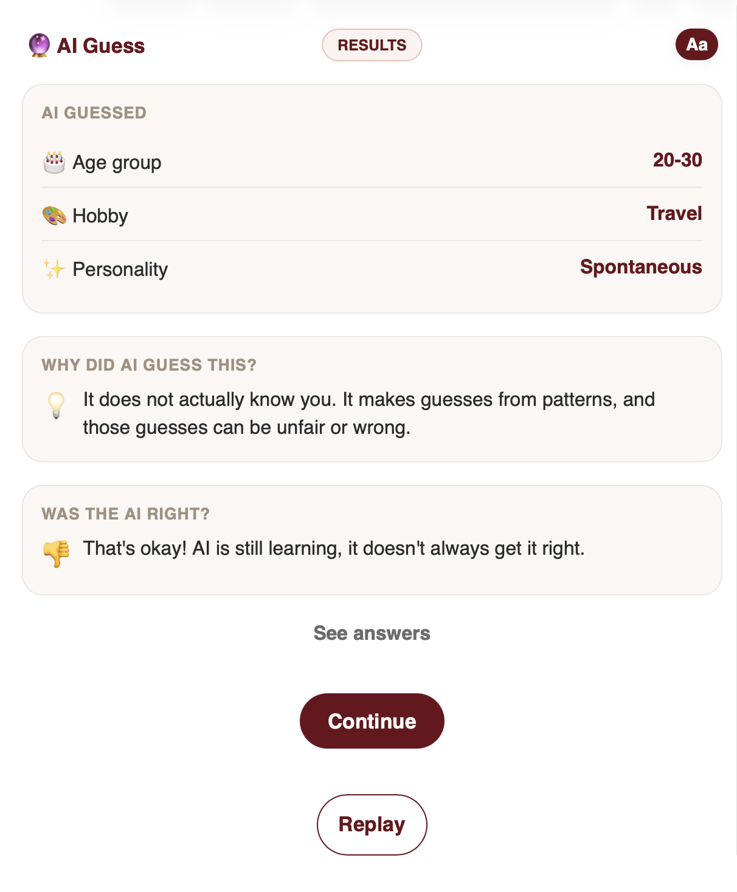
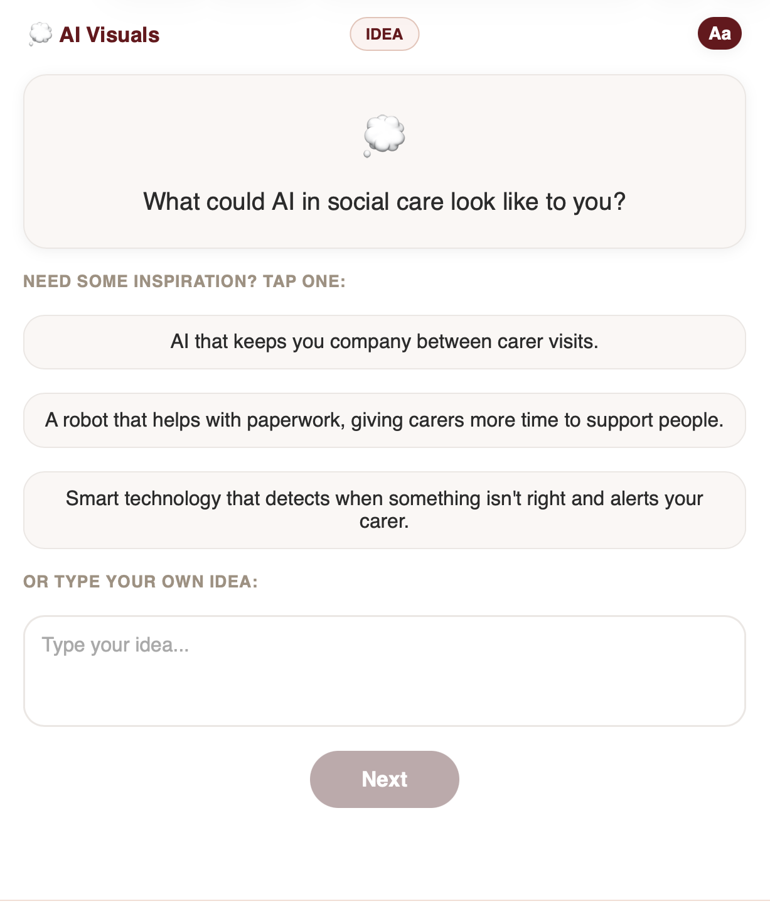
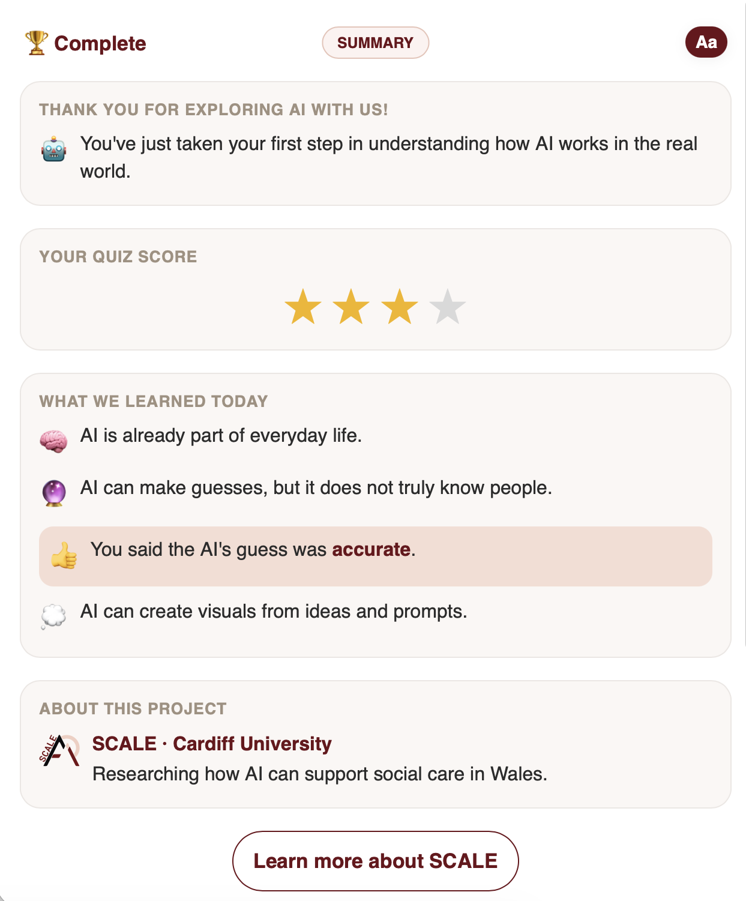

# AI in Social Care

## Overview

AI in Social Care combines educational content, interactive activities, and AI-powered features to encourage public engagement with emerging technologies. The application aims to improve understanding of AI concepts while highlighting important topics such as fairness, bias, and responsible AI use.

---

## Features

### AI Quiz

- Interactive quiz introducing key AI concepts
- Explores topics such as fairness, bias, and decision-making
- Accessible and user-friendly interface

### AI Guess Activity

- Users answer a series of questions
- AI generates predictions based on response patterns
- Demonstrates how AI makes inferences from data

### AI Visualisation Activity

- Users submit ideas relating to AI in social care
- AI generates visual representations from prompts
- Encourages discussion around future AI applications

### Accessibility Features

- Adjustable text size
- High contrast mode
- Dyslexia-friendly font support
- Responsive design
- Keyboard-accessible controls

---

## Technologies

### Frontend

- React
- JavaScript
- HTML5
- CSS3

### Backend

- Node.js
- Express.js

### AI Integration

- Google Gemini API

### Deployment

- Netlify
- Render

---

## Installation

Clone the repository:

```bash
git clone https://github.com/Salmah1/public-engagement-app.git
cd public-engagement-app
```

Install dependencies:

```bash
npm install
```

Create a `.env` file and add:

```env
GEMINI_API_KEY=your_api_key_here
```

Start the application:

```bash
npm start
```

---

## Project Structure

```text
public-engagement-app/
│
├── public/
├── screenshots/
│
├── server/
│   ├── images/
│   ├── data.txt
│   └── index.js
│
├── src/
│   ├── components/
│   │   └── AccessibilityPanel.js
│   │
│   ├── data/
│   │   ├── guessQuestions.js
│   │   └── quizQuestions.js
│   │
│   ├── pages/
│   │   ├── Home.js
│   │   ├── QuizIntro.js
│   │   ├── Quiz.js
│   │   ├── QuizResults.js
│   │   ├── GuessIntro.js
│   │   ├── Guess.js
│   │   ├── GuessResults.js
│   │   ├── Output.js
│   │   └── Final.js
│   │
│   ├── styles/
│   │   ├── Accessibility.css
│   │   ├── Global.css
│   │   ├── Home.css
│   │   ├── Quiz.css
│   │   ├── Guess.css
│   │   ├── Output.css
│   │   ├── Final.css
│   │   └── HighContrast.css
│   │
│   ├── App.js
│   └── index.js
│
└── README.md
```

---

## Screenshots

### Home Screen



### AI Quiz



### Quiz Results



### AI Guess in Dark Mode



### AI Guess Results



### AI Visual



### Final Results


